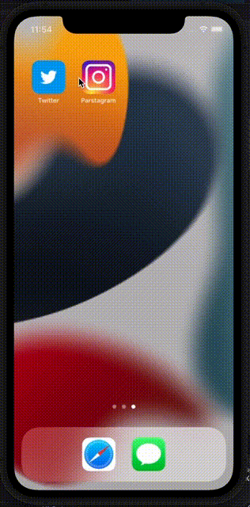

# Parstagram - Part II

This is an Instagram clone with a custom Parse backend that allows a user to post photos, view a global photos feed, and add comments!

Time spent: **5** hours spent in total

## User Stories

The following **required** functionality is completed:

- [x] User stays logged in across restarts. (1pt)
- [x] User can log out. (1pt)
- [x] User can view comments on a post. (3pts)
- [x] User can add a new comment. (5pts)

The following **bonus** features are implemented:

- [ ] User can add a profile picture. (2pts)
- [ ] Profile pictures are shown for posts and comments. (2pts)

## Video Walkthrough

Here's a walkthrough of implemented user stories:

# Parstagram - Part I

This is an Instagram clone with a custom Parse backend that allows a user to post photos and view a global photos feed.

Time spent: **6** hours spent in total

## User Stories

The following **required** functionality is completed:

- [x] User sees app icon in home screen and styled launch screen. (1pt)
- [x] User can sign up to create a new account. (1pt)
- [x] User can log in. (1pt)
- [x] User can take a photo, add a caption, and post it to the server. (3pt)
- [x] User can view the last 20 posts. (4pts)

The following **bonus** features are implemented:

- [ ] User can pull to refresh. (1pt)
- [ ] User can load past posts infinitely. (2pts)

## Video Walkthrough

Here's a walkthrough of implemented user stories:

# Twitter - Part II

This is a basic twitter app to view, compose, favorite, and retweet tweets.

Time spent: **5** hours spent in total

## User Stories

The following **required** functionality is completed:

- [x] User can compose a tweet. (4pts)
- [x] User can favorite a tweet. (4pts)
- [x] User can retweet a tweet. (2pts)

The following **bonus** features are implemented:

- [ ] When composing a tweet, user sees a countdown for the number of characters remaining for the tweet (out of 280) (2pts)
- [ ] User can view their profile in a profile tab. (3pts)
- [ ] User sees embedded images in tweet if available. (3pts)

## Video Walkthrough

Here's a walkthrough of implemented user stories:

# Twitter - Part I

This is a basic twitter app to read your tweets.

Time spent: **6** hours spent in total

## User Stories

The following **required** functionality is completed:

- [x] User sees app icon in home screen and styled launch screen. (1pt)
- [x] User can log in. (1pt)
- [x] User can log out. (1pt)
- [x] User stays logged in across restarts. (1pt)
- [x] User can view tweets with the user profile picture, username, and tweet text. (6pts)

The following **bonus** features are implemented:

- [x] User can pull to refresh. (1pt)
- [x] User can load past tweets infinitely. (2pts)

## Video Walkthrough

Here's a walkthrough of implemented user stories:

## Flix Part 2

### User Stories

#### REQUIRED (10pts)
- [x] (5pts) User can tap a cell to see more details about a particular movie.
- [x] (5pts) User can tap a tab bar button to view a grid layout of Movie Posters using a CollectionView.

#### BONUS
- [ ] (2pts) User can tap a poster in the collection view to see a detail screen of that movie.
- [ ] (2pts) In the detail view, when the user taps the poster, a new screen is presented modally where they can view the trailer.

### App Walkthrough GIF

 

### Notes
Again, my xcode was not connecting the Swift Collection View Cell Object With the Collection View. I feel like I am doing every step the same as the video, yet I get an error. Then when I redo the steps, it somehow works, but I can not find my mistake. 

# Flix

Flix is an app that allows users to browse movies from the [The Movie Database API](http://docs.themoviedb.apiary.io/#).

## Flix Part 1

### User Stories

#### REQUIRED (10pts)
- [x] (2pts) User sees an app icon on the home screen and a styled launch screen.
- [x] (5pts) User can view and scroll through a list of movies now playing in theaters.
- [x] (3pts) User can view the movie poster image for each movie.

#### BONUS
- [ ] (2pt) User can view the app on various device sizes and orientations.
- [x] (1pt) Run your app on a real device.

### App Walkthrough GIF

 

### Notes
I ran into a horrible bug that had to do with creating a new Swift file for the table cell and it turned out that I did not name my identifier properly.
